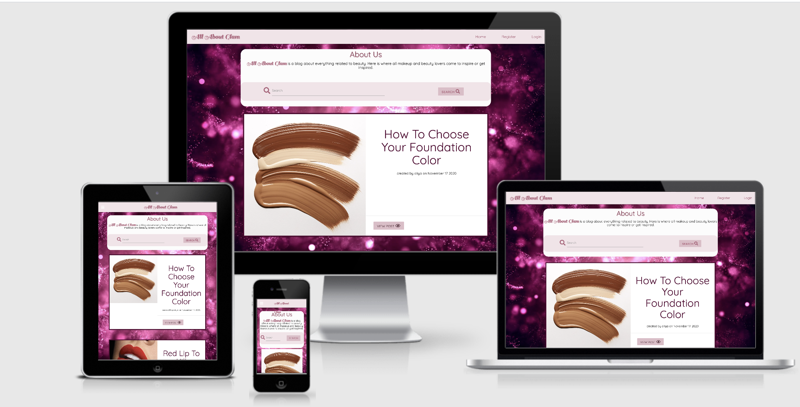

# [All About Glam](https://all-about-glam-blog.herokuapp.com/) - Milestone Project : Data Centric Development - Code Institute 



<p align=center>
<a href="https://all-about-glam-blog.herokuapp.com/">Open App</a></p>

## Table Of Content 

- [**About**](#About)
  - [**Why This Project**](#Why-This-Project)
- [**UX**](#UX)
  - [**User Stories**](#User-Stories)
  - [**Research**](#Research)
  - [**Wireframes**](#Wireframes)
  - [**Design**](#Design)
- [**Features**](#Features)
  - [**Functionality**](#Functionality)
  - [**Existing Feautures**](#Existing-Features)
  - [**Features Left To Implement**](#Features-Left-To-Implement)
- [**Technologies Used**](#Technologies-Used)
  - [**Languages**](#Languages)
  - [**Tools**](#Tools)
  - [**Libraries**](#Libraries)
  - [**Frameworks**](#Frameworks)
  - [**Database**](#Database)
  - [**Hosting**](#Hosting)
- [**Testing**](#Testing)
  - [**Browsers**](#Browsers)
  - [**Devices**](#Devices)
  - [**Testing User Stories**](#Testing-User-Stories)
  - [**Manual Testing**](#Manual-Testing)
  - [**Unresolved Bugs**](#Unresolved-Bugs)
  - [**Code Validation**](#Code-Validation)
- [**Deployment**](#Deployment)
  - [**Live App Link**](#Live-App-Link)
  - [**Repository Link**](#Repository-Link)
  - [**Running Code Locally**](#Running-Code-Locally)
- [**Credits**](#Credits)
  - [**Content**](#Content)
  - [**Acknowledgements**](#Acknowledgements)
  - [**Media**](#Media)
  - [**Disclaimer**](#Disclaimer)  


## About
This application is a blog and was created for users to get inspired and share anything related to beauty. Users can create an account where they can add as many blog posts as they like for free!

## Why This Project?
This application was created for my 3rd Milestone Project with Data Centric Development for [Code Institute](https://codeinstitute.net/). I used Python and a no-SQL database, MongoDB, to create this project which uses CRUD operations to allow users to create, read, update and delete their posts.

## UX

### User Stories
* As a user, I want to be able to create my own account.
* As a user, I want to be able to log in and out of my account.
* As a user, I want to read inspiring posts from the web application.
* As a user, I want to be able to create a blog post.
* As a user, I want to be able to edit and update my blog posts.
* As a user, I want to be able to delete my blog posts.
* As a user, I want to be able to view my profile account.
* As a user, I want to be able to search and find a post.

### Research
I researched tutorials with Python and MongoDB on Youtube and Udemy, to understand more how to create a CRUD application and I could get a clear idea of what functionality and design I wanted my web application to have, however most of this project's user authentication functionality was taken from [Code Institute's](https://codeinstitute.net/) task manager mini project.

### Wireframes
To create this project's wireframes I used [Balsamiq](https://balsamiq.com/).

* When user is logged in
   * [Home](https://github.com/Vasileia-Apostolou/all_about_glam_blog/blob/master/wireframes/Home.pdf)
   * [Search](https://github.com/Vasileia-Apostolou/all_about_glam_blog/blob/master/wireframes/Search.pdf)
   * [Users Profile](https://github.com/Vasileia-Apostolou/all_about_glam_blog/blob/master/wireframes/Profile.pdf)
   * [Create New Post](https://github.com/Vasileia-Apostolou/all_about_glam_blog/blob/master/wireframes/Create_New_Post.pdf)
   * [Edit Post](https://github.com/Vasileia-Apostolou/all_about_glam_blog/blob/master/wireframes/Edit_Post.pdf)
   * [Delete Post](https://github.com/Vasileia-Apostolou/all_about_glam_blog/blob/master/wireframes/Delete.pdf)
   * [View Post](https://github.com/Vasileia-Apostolou/all_about_glam_blog/blob/master/wireframes/View_Post.pdf)

* When user is logged out 
   * [Home](https://github.com/Vasileia-Apostolou/all_about_glam_blog/blob/master/wireframes/Home.pdf)
   * [Search](https://github.com/Vasileia-Apostolou/all_about_glam_blog/blob/master/wireframes/Search.pdf)
   * [Register](https://github.com/Vasileia-Apostolou/all_about_glam_blog/blob/master/wireframes/Register.pdf)
   * [Login](https://github.com/Vasileia-Apostolou/all_about_glam_blog/blob/master/wireframes/Login.pdf)

During the development process some changes were made.

### Design
I wanted a pink color scheme for this project to give a girly and fun look. For the background I used a glittery fuchsia image and I kept the color of the navbar, footer and buttons the same pink color scheme. All forms have a white background with black text and icons. 

## Features

### Functionality
The web application uses Python login to allow user to register or login/logout to their account for free and in addition it offers CRUD operations which allows users to create, read, update and delete their posts.

### Existing Features
- **Register** -
 Users can create their own account for free by filling the form and providing a username, email address and password which are required and stored in the database. The Form cannot be submitted if the username already exists but can create multiple accounts with the same email address. The users passwords are hashed for security purposes.

- **Login** - 
The login form has a username and password field which if correctly put in the users can login in their account.

- **Logout** - 
Users can logout from their account by clicking "Logout" in the navbar. 

- **Users Profile** -
Users who are registered and logged in can visit their profile page.

- **Create Post** -
Users can click on "Create Post" link in the navbar and will be directed to a form that has to be filled in with post title, image (optional), and content in order to create a new post. When the user clicks on the "Create Post" button, they will be redirected to the home page where they will be able to see their new post.

- **Edit Post** -
If the users want to update their post, they can click on the "Edit" button which appears at the bottom of their post. Also when they click on the "View Post" button, the post will open in a seperate page where they will still have the option of updating their post. Once the "Edit" button is clicked, a form will display in a separate page with the title, image url and content already written as it is. Then changes in the inputs can be made and updated by clicking on the "Update" button. In case the users change their mind on updating their post, there is a "Cancel" button which will redirect them to the home page. Users can only edit their post and not others.

- **Delete Post** -
If the users want to delete their post, they can click on the "Delete" button which appears at the bottom of their post. Also when they click on the "View Post" button, the post will open in a seperate page where they will still have the option of deleting their post. Once the "delete" button is clicked, a pop-up will appear with the message "Are you sure you want to delete this post?". Then the user has the option of deleting the post by clicking the "Delete" button or cancel with the "Cancel" button which will exit the pop-up. Users can only delete their post and not others.

- **View Post** -
On the bottom left of every post there is a "View Post" button which opens the post in a seperate page and displays the full post alone. Only the he user who created that post has the option of editing or deleting the post.

- **Blog Post** - 
Blog posts are displayed in the home page from newest to oldest.

- **NavBar** -
The navbar link vary depending on whether the user is logged in or not. If the user is logged in, the navbar will have Home, Profile, Create Post and Logout links. If the user is logged out, the navbar will have Home, Register and Login links. The navbar collapses to a hamburger menu when viewed in smaller screen sizes.

- **Search** -
The user can search a particular blog post by typing a word/words in the search bar. If there's any post that include the searched word/words, the post will appear in a seperate page below the search bar. If there's more than one post found, then all of them will display. If there are no results for that search then a text of "No Results Found" will display in a separate page.
Example : If the user searches the word "makeup" all posts that include "makeup" in the title or content will appear.

- **Footer** -
The footer includes a heading of "Connect With Us" and social media links.

- **Flash Messages** - 
Based on the user interaction, flash messages are displayed at the top of the page right below the navbar. Flash messages let users know that their actions are successfully completed.


### Features Left To Implement 

- **Users Profile** -
In the future, I would like the Users Profile to display all their information, give the user the option of uploading a profile picture and the option of changing their information or password. Plus I would like to give them the option of editing or deleting their account.

- **Share**-
In the future, I would like to add a feature which allows the users to share their post with others on social media.

- **Pagination** -
In the future, I would like to add pagination in my app to break the content into seperate pages for a more user-friendly experience.

- **Back Button** - 
In the future, I would like to add a button that takes a user back to "Home" page when they are on the "View Post" page.


## Technologies Used 

### Languages 
1. [HTML](https://en.wikipedia.org/wiki/HTML)

HTML was used in this project to keep up with the latest industry standards. 

2. [CSS](https://en.wikipedia.org/wiki/Cascading_Style_Sheets)

CSS was used for styling the content.

3. [JavaScript](https://en.wikipedia.org/wiki/JavaScript)

JavaScript was used to create the main functional logic of this app. 

4. [Python](https://en.wikipedia.org/wiki/Python_programming_language)

Python was used as the back-end programming language for this app.
 
* [Jinja](https://jinja.palletsprojects.com/en/2.11.x/) is a modern and designer-friendly templating language for Python. I used Jinja to simplify my HTML code, avoid repetition, and allow simpler linking of the back-end to the front-end.

### Tools 
1. [Git](https://git-scm.com/)

Git was used in this project for version control.

2. [Gitpod](https://www.gitpod.io/)

Gitpod was used to develop this project.

3. [Balsamiq](https://balsamiq.com/)

Balsamiq was used to create the wireframes.

4. [Dev Tools](https://developers.google.com/web/tools/chrome-devtools)

Chrome DevTools is a set of web developer tools built directly into the Google Chrome browser. DevTools can help you edit pages on-the-fly and diagnose problems quickly, which ultimately helps you build better websites, faster. Google Chrome's Dev Tools was used in the building process of this project.

### Libraries 
1. Icons were obtained from [Font Awesome](https://fontawesome.com/).

2. Fonts were taken from [Google Fonts](https://fonts.google.com/).

3. [Materialize](https://materializecss.com/) UI components help in constructing attractive, consistent, and functional web pages and web apps, while adhering to modern web design principles such as browser portability, device independence, and graceful degradation.

4. [PyMongo](https://pymongo.readthedocs.io/en/stable/) was used as the Python API for MongoDB. This API enables linking the data from the back-end database to the front-end app.

### Frameworks 
1. [jQuery](https://jquery.com/) is a fast, small, and feature-rich JavaScript library. It was used in this project to simplify the DOM.

2. [Flask](https://flask.palletsprojects.com/en/1.1.x/) is a micro web framework written in Python. 

### Database
* [MongoDB](https://www.mongodb.com/) was used to store the database. The informatio displayed in the front-end app is pulled from the database store.

### Hosting 
* [Heroku](https://www.heroku.com/) was used as the hosting platform to deploy this app.

## Testing

### Browsers
This web application was tested in the following browsers to ensure the web application is compatible and responsive.
 * Chrome
 * Mozilla
 * Safari
 * Opera 
 * Internet Explorer

 ### Devices
 This web application was tested in the following devices to ensure the web application is compatible and responsive.
 * IPhone 8 Plus
 * Huawei P30 Pro 
 * Huawei Mediapad T5
 * MacBook Pro

 ### Testing User Stories
- **As a user, I want to be able to create my own account.** 
 1. Click on the "Register" link in the navbar.
 2. Fill in the Register Form with a username, email address and password.
 3. Click on "Register" button.
 4. Flash message will appear saying "Account successfully created!"

- **As a user, I want to be able to log in and out of my account.** 
  * LOGIN 
  1. Click on the "Login" link in the navbar.
  2. Fill in the Login Form with your username and password.
  3. Click on the "Login" button. 
  4. Flash message will appear saying "Welcome, (username)"
  * LOGOUT 
  1. Click on the "Logout" link in the navbar.
  2. Flash message will appear saying "You have been logged out!"

- **As a user, I want to be able to create a blog post.** 
 1. Click on the "Create Post" link in the navbar.
 2. Fill in the Form with a post title, image URL(optional) and content.
 3. Click on "Create Post" button.
 4. Flash message will appear saying "New post created!"

- **As a user, I want to read inspiring posts from the web application.** 
 1. Click on the "Home" link in the navbar or on the "All About Glam" navbar brand.

- **As a user, I want to be able to edit and update my blog posts.** 
 1. Click on the "Edit" button displayed on the post you want to edit.
 2. Update the Form with the post title, image URL(optional) and content.
 3. Click on "Update" button.
 4. Flash message will appear saying "Post updated!"

 OR

 1. On the "View Post" page, click on the "Edit" button.
 2. Update the Form with the post title, image URL(optional) and content.
 3. Click on "Update" button.
 4. Flash message will appear saying "Post updated!"
 
- **As a user, I want to be able to delete my blog posts.**
 1. Click on the "Delete" button displayed on the post you want to delete.
 2. Click on the "Delete" button on the pop up.
 3. Flash message will appear saying "Post deleted!"

OR

 1. On the "View Post" page, click on the "Delete" button.
 2. Click on the "Delete" button on the pop up.
 3. Flash message will appear saying "Post deleted!"

- **As a user, I want to be able to view my profile account.**
 1. Click on the "Profile" link in the navbar.

- **As a user, I want to be able to search a post.**
 1. Type a word related to the post you are looking for.
 2. Click on the "Search" button.


 ### Manual Testing
 * I tested the registration form by creating several fake user accounts with a username, email address, password and tested the "Register" button.
 * I logged in from several fake user accounts using the username and password and tested the "Login" button.
 * I tested the log out funtion from all accounts by clicking on the "Logout" button.
 * I created hundreds of new posts and I tested the form inputs and "Create Post" button.
 * I tested that all post created display in the "Home" page.
 * I tested the edit function by updating the title, image url and content of the post and tested the "Update" button.
 * I tested that the "Cancel" button takes user from the "Edit Post" page back to "Home".
 * I tested the Image URL input by copying image address from google images.
 * I tested the delete post funtion by clicking on the "Delete" button and tested defensive programming by again clicking on the "Delete" button which appears in a pop-up.
 * I tested that the "Cancel" button exits the delete pop-up.
 * I tested that the "View Post" button displays the post alone in a seperate page.
 * I tested the search bar by typing words that existing and words that don't exists in posts that I created. Also I tested that the "No Results Found" text appears when there are no results found.
 * I tested that all flash messages appear to the correct action with the correct message. 
 * I tested the navbar to make sure that when the user is logged in the only navbar links that appear are "Home", "Profile", "Create Post" and "Logout", and when the user is logged out the only navbar links that appear are "Home", "Register" and "Login". 
 * I tested that the "Login" and "Register" anchor tags under the "Login" and "Register" forms work correctly.
 * I tested the navbar responsiveness and it collapses to a hamburger menu and displays all navbar links correctly.
 * I tested that the "All About Glam" navbar brand redirects user to the Home page.
 * I tested all social media links in the footer.
 * I tested what happens if the user closes the tab and reopens it. The user will remain logged in.

App link was also shared with friends and family for further use and testing.

After many tests I confirm that all functionalities work and appear as intended on different screen sizes.

### Unresolved Bugs

* A user who is logged in can still have access to the "Login" page by typing /login in the URL link. 
* A user can access the "Edit" page and edit other's posts by typing /edit_post in the URL link.

### Code Validation
The web application's HTML and CSS code has been tested in [W3C Validator](https://validator.w3.org/). The JavaScript code has been tested in [JS Hint](https://jshint.com/). Python syntax has been tested in [Pep8 Online Tool](http://pep8online.com/) and responsiveness was tested in [Resposinator](https://www.responsinator.com/), [Am I Responsive](http://ami.responsivedesign.is/) and [Mobile-Friendly Test](https://search.google.com/test/mobile-friendly).

## Deployment 

####  [Live App Link](https://all-about-glam-blog.herokuapp.com/)
#### [Repository Link](https://github.com/Vasileia-Apostolou/all_about_glam_blog)

I used GitHub for my version control and Heroku to host the live version of my project. To deploy my website to Heroku, I used the following steps:

1. Created the app in Heroku.
2. Ran the `sudo snap install --classic heroku` command in the terminal window to install heroku in my local workspace.
3. Ran the `heroku login --interactive` command in the terminal window and entered my credentials to login to Heroku.
4. Added and committed the files to Git using the `git add .` and `git commit -m ""` commands in the terminal window.
5. Linked the Heroku app as the remote master branch using the following command in the terminal window:

    ```heroku git:remote -a <app-name>```

6. Created a requirements.txt file using the following command in the terminal window:

    ```sudo pip3 freeze --local > requirements.txt```

7. Created a Procfile using the following command in the terminal window:

    ```echo web: python <fileName.py> > Procfile```

8. Ran the `git push heroku master` command in the terminal window to push the app to Heroku.
9. Ran the `heroku: ps:scale web=1` command in the terminal window to run the app in Heroku.
10. Entered the following Config Var in Heroku:

    ```MONGO_URI : <link to MongoDB>```

I didn't need to upload the IP and PORT Config Vars in Heroku, as these were already present in my `app.py` file.

The app was successfully deployed to Heroku at this stage.

### Running Code Locally 
To run my code locally, users can download a local copy of my code to their desktop by completing the following steps:

1. Go to [my GitHub repository](https://github.com/Vasileia-Apostolou/all_about_glam_blog).
2. Click on 'Clone or download' under the repository name.
3. Copy the clone URL for the repository in the 'Clone with HTTPs section'.
4. Open 'Git Bash' in your local IDE.
5. Change the current working directory to the location where you want the cloned directory to be made.
6. Type `git clone`, then paste the URL you copied in Step 3:

    ```git clone https://github.com/USERNAME/REPOSITORY```

7. Press `Enter` to complete the process and create your local clone.
8. Create collections named *_blog_*, *_blogpost_* and *_users_*.
9. Navigate to the `.bashrc` terminal and add your MongoDB URI in the following format:

    ```MONGO_URI="insert your mongo uri details here"```

10. In the terminal, run the `pip3 install -r requirements.txt` command to install the requirements.txt file.
11. You should now be able to run the app locally using the `python3 app.py` command.

## Credits 

### Content
* Modal Structure HTML and JavaScript code was taken from [Materialize Modals](https://materializecss.com/modals.html).
* Forms Structure was taken from [Materialize Forms](https://materializecss.com/text-inputs.html).
* NavBar HTML and JavaScript code was taken from [Materialize NavBar](https://materializecss.com/navbar.html).

### Media 
* Background Image was taken from [Google Images](https://www.google.dk/imghp?hl=en&tab=wi&authuser=0&ogbl) .
* None of the post images belong to me. I have taken all images from different and random [Google](https://www.google.dk/imghp?hl=en&tab=wi&authuser=0&ogbl) searches.

### Acknowledgements
* Overall project and README file was inspired by [this](https://github.com/hebs87/cookbook-milestone-project-three) project.
* Most of this project's user authentication functionality was taken from [Code Institute's](https://codeinstitute.net/) task manager mini project.
* I got help on fixing errors and hints on how to solve problems from [Stack Overflow](https://stackoverflow.com/) and [Slack](https://slack.com/intl/en-dk/).

### Disclaimer
This project is for educational purposes only.

([Back to the top ↑](#all_about_glam_blog))
